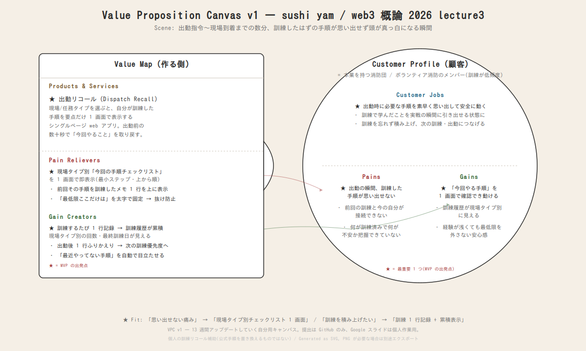

# VPC v1 — sushi yam / web3 概論 2026 lecture3

> Strategyzer 形式の Value Proposition Canvas を、本課題ルールに沿って v1 として確定させたもの。
> 13 週間、毎週ここをアップデートしていく自分用キャンバス。

---

## 選んだ「1 つの場面」(scene)

**消防団のボランティアとして出動指令を受けてから現場に着くまでの数分間、過去に訓練したはずの手順(資器材の扱い・現場での動き・無線/連携の段取り)が思い出せず、頭が真っ白になる瞬間。**

bug-list.md の ★#21 を起点に選定。日常のバグに共通する「前回の自分と接続できない」傾向(#6 / #16 / #19)が、
**低頻度の訓練・時間圧・命に関わる現場** という条件で最も尖って出る場面。失敗のコストが日常の比ではない。

> ⚠️ 本プロダクトは **個人の「訓練リコール補助」** であり、正式な指揮系統・標準手順・公式マニュアルを置き換えるものではない。あくまで自分の訓練記憶を引き出すための私的な補助ツールとして設計する。

---

## Customer Profile (顧客)

顧客 = **本業を別に持ちながら参加している消防団 / ボランティア消防のメンバー**
(訓練の機会が限られ、出動も不定期。とくに経験の浅い新人〜中堅ほど「思い出せない」が深刻)

### Customer Jobs(顧客が片付けたい仕事)

- **★ 出動時に、今回の現場・任務に必要な手順を素早く思い出して、安全かつ正確に動く**
- 限られた訓練で学んだことを、実戦の瞬間に確実に引き出せる状態にしておく
- 訓練したことを忘れずに積み上げ、次の訓練・出動につなげる

### Pains(痛み)

- **★ 出動の瞬間、過去に訓練した手順が思い出せない(頻度が低く記憶が薄れる/緊張で飛ぶ)**
- 前回の訓練からの間隔が空き、訓練内容と今の自分が接続できない
- 何を訓練済みで、何が不安なまま残っているかを自分でも把握できていない

### Gains(得たい成果)

- **★ 出動時に「今回やる手順」を 1 画面で確認でき、落ち着いて動ける**
- 自分の訓練履歴が積み上がり、現場タイプ別に「何を・どれだけ・いつ」訓練したかが見える
- 経験が浅くても、現場で最低限の手順を外さない安心感

---

## Value Map (作る側)

### Products & Services

- **★ 出動リコール(Dispatch Recall)** — 現場/任務タイプを選ぶと、自分が訓練した手順を要点だけ 1 画面で出すシングルページ web アプリ。
  出動前の数十秒で「今回やること」を取り戻すことに全振りする。

### Pain Relievers(★ Pains に対応)

- **★ 現場タイプ別に「今回の手順チェックリスト」を 1 画面で即表示**
  - 緊張時でも追える最小ステップに圧縮。スクロールなしで上から順に。
- 前回その手順を訓練したメモ 1 行を上に表示 → 過去の訓練の自分と接続
- 「最低限ここだけは」を太字で固定 → 抜け落ちを防ぐ

### Gain Creators(★ Gains に対応)

- **★ 訓練するたびに 1 行記録 → 訓練履歴が累積し、現場タイプ別の訓練回数・最終訓練日が見える**
- 出動後に 1 行のふりかえりを残す → 次に優先して訓練すべき手順が浮かび上がる
- 「最近やってない手順」を自動で目立たせ、感覚ではなくデータで不安を埋める

---

## Fit(★ 同士の整合確認)

| 顧客側(★) | 作る側(★) | 整合 |
|---|---|---|
| Pain: 出動時に訓練手順を思い出せない | Pain Reliever: 現場タイプ別チェックリストを 1 画面表示 | ✅ 「思い出す」作業を最小化して直撃 |
| Gain: 落ち着いて動ける / 履歴が見える | Gain Creator: 訓練 1 行記録 + 累積可視化 | ✅ 訓練の積み上げをデータ化して可視化 |
| Job: 出動時に必要手順を即引き出す | Product: 出動リコール(1 画面) | ✅ 場面と同じ粒度のプロダクト |

> Fit の判定: ★ ↔ ★ の対応が 1 対 1 で取れていることを v1 の合格基準とする。
> v2 以降で他の Pains / Gains にも Reliever / Creator を増やしていく。

---

## Products = 作るプロダクト 1 つ

### **出動リコール(Dispatch Recall)**

- **何**: 出動時に「今回の現場でやる手順」を 1 画面で思い出し、訓練を 1 行で積み上げるシングルページ web アプリ
- **構成案(MVP)**:
  - 現場/任務タイプを事前登録(例: 火災対応 / 救助 / 資器材点検 / 無線・連携 など)
  - 出動時、タイプを 1 つ選ぶと「今回の手順チェックリスト」を大きく 1 画面で表示
  - 各手順に「前回訓練したメモ 1 行」と「最終訓練日」を添える → 過去の自分と 1 秒で接続
  - 訓練したら「訓練済み」+ 1 行メモ → ローカル保存
  - 累積ビュー(現場タイプ別の訓練回数・最終訓練日・最近やってない手順の強調)
- **技術**: Vanilla HTML/CSS/JS + LocalStorage(week01-02 と同じ依存ゼロ路線)
- **week01-02 との接続**: week02「打つ/ペーストの速さ」に続き、今回は出動時の **"思い出す速さ"** を扱う。
  現実の「立ち上げ/想起のコストが高い行動」をシングルページ化して軽くする思想を継承。

---

## v2 以降にやりたいこと(VPC は 13 週育てる)

- ★ 以外の Pains / Gains に対する Reliever / Creator を肉付け
- 顧客セグメント細分化(新人 vs. 中堅、消防団 vs. 他のボランティア緊急対応)
- 「現場タイプから手順を提案する」部分の設計詳細化(AI 補助の是非も含む)
- **Web3 要素の判断**: 訓練・出動の履歴をオンチェーンに記録し、改ざんできない「訓練の証明」として積み上げるか
  (累積を自分のものとして残す = Web3 的思想と、訓練実績の信頼性が直結する有力な使い道)
